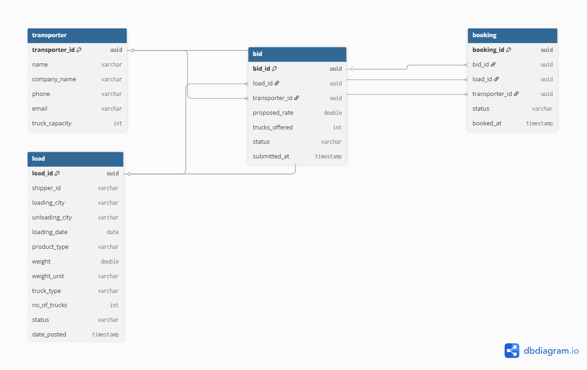

# 🚛 Transport Management System (TMS) Backend


---

## 🗂️ Database Schema Diagram



_This is the database schema diagram for the TMS backend.  
If you need to update it, edit it using [draw.io](https://app.diagrams.net/) or [dbdiagram.io](https://dbdiagram.io/) and replace `tms_DB.png`._

---

## 📘 API Documentation

- **Swagger UI:** [http://localhost:8080/swagger-ui.html](http://localhost:8080/swagger-ui.html)  
- **Postman Collection:** *(Add your Postman collection link here)*

---

## 🧪 Test Coverage

  
_Generate this using [JaCoCo](https://www.eclemma.org/jacoco/) or IntelliJ IDEA and place the screenshot under `docs/test-coverage.png`._

---

## 🧾 Overview

This project is a **Spring Boot** backend for a **Transport Management System (TMS)** — a logistics platform designed to manage loads, transporters, bids, and bookings.  
It follows **clean architecture principles**, uses **Spring Data JPA** for persistence, and **Swagger/OpenAPI** for documentation.

### 🧠 Tech Stack
- **Backend:** Spring Boot 3.x, Java 17  
- **Database:** PostgreSQL  
- **Build Tool:** Maven  
- **Documentation:** Swagger / OpenAPI  
- **Testing:** JUnit 5, JaCoCo  

---

## ✨ Key Features

✅ **Load Management** – Create, update, and track shipments  
✅ **Transporter Management** – Register and manage transporter details  
✅ **Bid System** – Transporters bid on loads; shippers can accept bids  
✅ **Booking System** – Confirmed bids become bookings  
✅ **Status Tracking** – Enum-based workflow states for loads/bids/bookings  
✅ **Exception Handling** – Centralized error responses via GlobalExceptionHandler  
✅ **Pagination & Filtering** – Built-in support for pageable APIs  
✅ **Swagger UI** – Interactive REST documentation

---

## 📁 Project Structure

backend/
├── src/main/java/com/ManasRanjanDikshit/tms/backend/
│ ├── entity/ # JPA entities (Load, Transporter, Bid, Booking, enums)
│ ├── repository/ # Spring Data JPA repositories
│ ├── dto/ # Data Transfer Objects for requests/responses
│ ├── exception/ # Custom exceptions and global handler
│ ├── service/ # Business logic for each domain
│ ├── controller/ # REST API controllers
│ └── config/ # Configuration (Swagger/OpenAPI)
├── src/main/resources/
│ ├── application.properties # Database and app config
│ ├── static/ # Static resources (optional)
│ └── templates/ # Templates (optional)
├── migration/ # SQL scripts (schema, seed data)
├── docs/ # Documentation assets (test coverage, diagrams)
├── pom.xml # Maven build file
└── README.md # Project documentation


---

## 🧩 Detailed Modules

### 🏗️ Entity Layer (`entity/`)
- **Load.java** – Represents a shipment  
- **Transporter.java** – Represents a transporter company  
- **Bid.java** – Transporter’s bid on a load  
- **Booking.java** – Confirmed shipment after bid acceptance  
- **Enums** – `LoadStatus`, `BidStatus`, `BookingStatus`, `WeightUnit`

### 💾 Repository Layer (`repository/`)
- CRUD + custom queries using Spring Data JPA

### 📤 DTO Layer (`dto/`)
- Request and response classes for clean API communication

### ⚙️ Service Layer (`service/`)
- Core business logic for loads, bids, bookings, and transporters

### 🌐 Controller Layer (`controller/`)
- REST API endpoints for CRUD and business operations

### 🛡️ Exception Layer (`exception/`)
- Custom exceptions and `GlobalExceptionHandler` for unified error responses

### 🔧 Config Layer (`config/`)
- **SwaggerConfig.java** – Enables API documentation and testing UI

---

## 🧰 How to Run the Project

### 1️⃣ Prerequisites
- Install **Java 17+**
- Install **PostgreSQL**
- Install **Maven**

### 2️⃣ Configure Database
Edit `src/main/resources/application.properties`:

3️⃣ Build & Run
bash
Copy code
# Build the project
mvn clean install

# Run the Spring Boot app
mvn spring-boot:run
App will start at: http://localhost:8080

🔍 Sample API Usage
Create a Load
bash
Copy code
curl -X POST http://localhost:8080/api/loads \
  -H "Content-Type: application/json" \
  -d '{
        "origin": "Mumbai",
        "destination": "Delhi",
        "weight": 1200,
        "weightUnit": "KG"
      }'
Get All Loads
bash
Copy code
curl http://localhost:8080/api/loads
👨‍💻 For Beginners
Concept	Description
Entity	Maps Java classes to database tables
Repository	Handles database CRUD operations
DTO	Transfers data between backend and frontend
Service	Contains business logic
Controller	Exposes REST endpoints
Exception	Handles errors gracefully
Swagger UI	Interactive API documentation

🤝 Contribution Guide
Fork this repository

Create a new feature branch

Commit your changes with descriptive messages

Submit a pull request 🎉

📜 License
This project is open-source and available under the MIT License.

📬 Contact
👤 Maintainer: Manas Ranjan Dikshit
📧 Email: manasranjandikshit01@gmail.com
🌐 GitHub: Manas-Dikshit

🧭 Quick Reference
Package	Purpose
entity	Database entities & enums
repository	Data access layer (Spring Data JPA)
dto	API request/response objects
exception	Custom exceptions & handlers
service	Core business logic
controller	REST endpoints
config	Swagger/OpenAPI configuration
resources	App config, static files, templates

⭐ Pro Tip: Use mvn test + JaCoCo to generate coverage reports and place screenshots under docs/test-coverage.png.

🚚 Happy Coding! Build. Ship. Deliver.

markdown
Copy code

---

✅ **Instructions:**
1. Copy the above Markdown exactly as is.  
2. Save it in your project root as `README.md`.  
3. Ensure:
   - `tms_DB.png` → `backend/tms_DB.png`  
   - `docs/test-coverage.png` → `backend/docs/test-coverage.png`  
4. Run:
   ```bash
   git add README.md
   git commit -m "Added advanced GitHub-ready README with images"
   git push origin main
